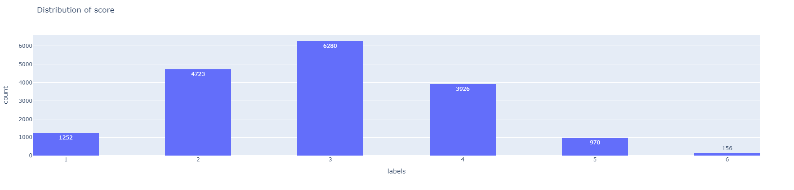

# Automatic Exam Scoring

## Goal

Le projet vise à améliorer l'évaluation des essais étudiants en utilisant le Machine Learning et le Traitement du Langage Naturel, en développant des modèles capables d'évaluer automatiquement les essais des étudiants, réduisant ainsi la nécessité de notation manuelle et le temps associé.

## Idea

We can solve this problem either by considering it :

* A multi label classification task --> 6 labels

* A Clustering task where k=6

