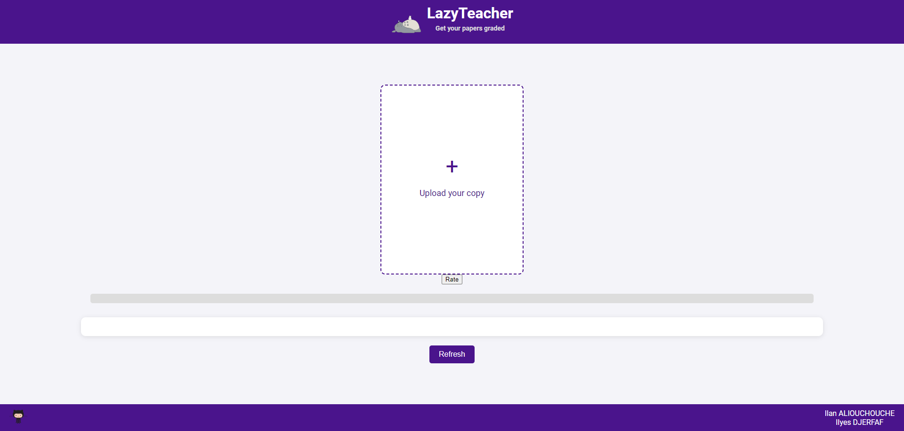

# Automatic Grades for Student Essays: End-to-End Machine Learning Project

Welcome to our repository! This project demonstrates an end-to-end solution for automatically grading student essays using advanced machine learning techniques, from initial data analysis to deployment. Our application accepts an essay image and outputs the text and its corresponding grade, leveraging a fine-tuned transformer model available on the [Hugging Face platform](https://huggingface.co/ilanaliouchouche/gte-base-lazy-teacher).

## Project Structure

The repository is organized into several key areas:

- `app/`: Contains the user interface for essay submission and grading display.
- `data/`: Datasets used in model training and evaluation.
- `endpoints/`: FastAPI implementation for deploying machine learning models as endpoints.
- `ml/`: Core machine learning code including exploratory data analysis, data preprocessing, and training scripts.

### Detailed Contents

1. **ML Folder:** Focuses on machine learning model development.
   - `preprocessing/`: Data preprocessing techniques, including exploratory data analysis and sampling methods.
   - `training/`: Model training scripts, exploring different machine learning algorithms and transformer models.

2. **Endpoints:** Contains FastAPI code for model deployment, allowing real-time essay grading.

3. **App:** A user-friendly interface for submitting essays and receiving grades.

## Getting Started

To get started with this project, clone the repository and install the required dependencies:

```bash
git clone https://github.com/mlengineershub/LazyTeacher
cd LazyTeacher
pip install -r requirements.txt
```

Refer to individual READMEs in each directory for more detailed instructions on running each component.

## Global Architecture


This diagram illustrates the comprehensive workflow of our project, from data handling and model training to deployment and user interaction.

Here is a look of our front end application :



## How to Use

Navigate through the project using the following links to understand and interact with the different components:

- [ML Folder](https://github.com/mlengineershub/LazyTeacher/tree/main/ml)
  - [Preprocessing Folder](https://github.com/mlengineershub/LazyTeacher/tree/main/ml/preprocessing)
  - [Training Folder](https://github.com/mlengineershub/LazyTeacher/tree/main/ml/training)
- [Endpoints](https://github.com/mlengineershub/LazyTeacher/tree/main/endpoints)
- [App Interface](https://github.com/mlengineershub/LazyTeacher/tree/main/app)

## Contributing

We encourage contributions to this project! Please consider the following steps to contribute:

1. Fork the repository.
2. Create your feature branch (`git checkout -b feature/AmazingFeature`).
3. Commit your changes (`git commit -m 'Add some AmazingFeature'`).
4. Push to the branch (`git push origin feature/AmazingFeature`).
5. Open a Pull Request.

## Contact

- Ilyes DJERFAF - [GitHub](https://github.com/ilyesdjerfaf)
- Ilan Aliouchouche - [GitHub](https://github.com/ilanaliouchouche)

We hope you find this project useful and we welcome any contributions or feedback!