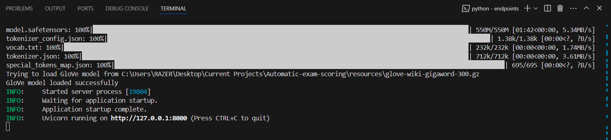
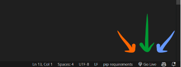
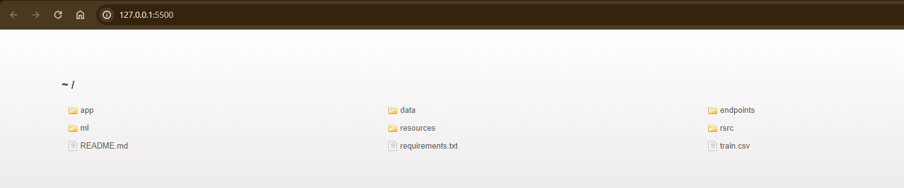
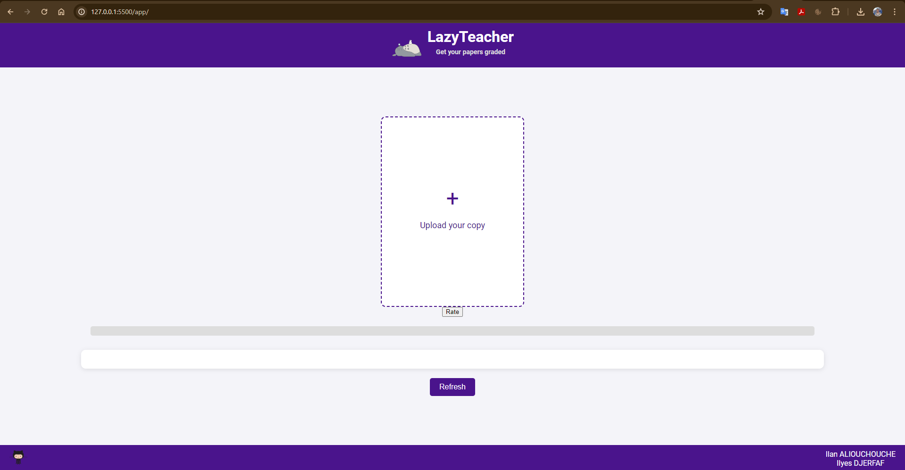

# User Interface for Automatic Essay Grading

Welcome to the Application section of our Automatic Essay Grading project. This directory contains the front-end code and resources for our user-friendly web application, where users can submit student essays and receive automatic grades.

## Overview

The application is designed to provide an intuitive interface for users to interact with our machine learning models seamlessly. It supports uploading an essay image, which is then processed to extract text and evaluate it using our trained models.

## Features

- **Essay Submission**: Users can upload images of student essays through a simple drag-and-drop interface.
- **Grade Prediction**: The application displays the predicted grade immediately after processing the essay.
- **Responsive Design**: Ensures that the application is accessible on various devices, from desktops to mobile phones.

## Technology Stack

- **HTML/CSS/JavaScript**: For building the interactive front-end.
- **FastAPI**: Used for the backend API that handles essay submissions and returns grades.
- **pytesseract**: Important for the Image to text conversion. Follow this [link](https://tesseract-ocr.github.io/tessdoc/Compiling.html) to get it in your device
- **Docker**: Optional for containerizing the application and simplifying deployment.

## Setup and Running

1. Ensure you have all necessary dependencies installed:
```bash
cd LazyTeacher
pip install -r requierements.txt
```

2. Please, make sure to install and setup correctly **Pytesseract**

3. If you are using VSCODE (recommended), install the extension : **Live Server**

4. Run this command to lunch the endpoint:

```bash
cd endpoints
python endpoint.py
```

5. You should get something like this :



6. Now you click on the **Go Live** button, found in the buttun right corner in VSCODE.



7. You should get something like this :



8. Click on the `app folder` and you will end up in the application



9. You can now upload a picture of a student essay. Click on `Rate`. And you will see MAGIC ! :D

        - Hint : You can use the images in the subfolder `test_grades_images` of the `app` folder :)

10. Click on `Refresh` to try again.

## Contributing

If you have suggestions for additional features or improvement, please feel free to contribute. Detailed instructions on how to contribute can be found in the main project README.

## Contact

For questions or additional information about the application, refer to the main project README or reach us out directly.

